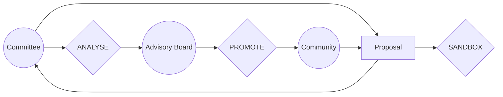

# DAO

# Entities

## Commitee

### Goal

The committee serves as the organizational/project's central decision-making hub, akin to its cognitive center. It oversees day-to-day operations and steers the implementation of the roadmap to achieve our goals.

Principles and rules are meticulously crafted to establish a framework that harmonizes representation, accountability, meritocracy, and community engagement within the organization. This framework ensures fairness, transparency, and inclusivity in our governance structure, empowering the committee to fulfill its multifaceted role effectively.

### Principles

•1. **Election Process**: Committee members are elected by the community members. This ensures that the committee is representative of the wider community and accountable to them.

•2. **Meritocracy Requirement**: Committee members must have a certain number of credits based on meritocracy earned through project participation. This ensures that committee members have demonstrated their commitment and capability within the organization.

•3. **Decision Making Authority**: The committee may take day-to-day decisions, overseen by the Advisory Board. Optional policies can be applied to determine how oversight is conducted, such as always, based on the level of importance, priority, or through random checks.

•4. **Collegial Decision Making**: Decisions within the committee are taken collegially. This means that decisions are made collectively after discussing and considering options, and consulting each committee member.

•5. **Audit and Allocation of Credit**: Individual decisions may be audited to allocate credit based on meritocracy voting power. This ensures transparency and fairness in the decision-making process.

•6. **Empowerment**: Each individual committee member is empowered by a combination of community voting power and meritocracy voting power. This weighting reflects both their mandate from the community and their demonstrated competence.

•7. **Proposal Production**: The committee may produce proposals to be presented to the community. This allows for the community to have input and feedback on significant decisions and initiatives.

## Advisory Board

## Goal

The Advisory Board acts as a strategic compass, offering guidance and oversight to ensure the effective functioning and alignment of the organization/project with its goals and values. It collaborates with the committee and community to optimize decision-making processes and foster continuous improvement.

## Principles

1. **Selection and Election:** Advisory board members are selected by the committee members but elected by the community members. This dual process ensures both expertise and community representation within the Advisory Board.

2. **Oversight of Committee Decisions:** The Advisory Board oversees the committee's day-to-day decisions, utilizing optional policies such as 'always', 'level of importance', 'priority', or 'random check'. This ensures consistency, efficiency, and adherence to organizational objectives.

3. **Review of Committee Proposals:** The Advisory Board reviews and provides feedback on proposals issued by the committee, ensuring they align with the organization's strategic direction and values.

4. **Collaboration on Community Proposals:** The Advisory Board collaborates with the committee in evaluating and refining proposals originating from the community, fostering inclusivity and community engagement in decision-making processes.

5. **Flexible Oversight Policies:** Day-to-day overseeing policies may be modified during the lifecycle of a project or even deactivated/reactivated as needed. This flexibility allows for adaptive governance and responsiveness to evolving organizational needs and circumstances.

## Community

### Goal

The community constitutes the vibrant heart of the organization/project, comprising individuals with diverse backgrounds, skills, and interests. Its members, categorized into developer, sponsor, and advisor members, collectively contribute to the growth, sustainability, and innovation of the organization/project.

### Principles

1.  **Membership Diversity:** Members of the community belong to different types, including developer members who actively contribute to project development, sponsor members who provide financial support or resources, and advisor members who offer strategic guidance and expertise. This diversity enriches the community's collective knowledge and capabilities.
    
2.  **Proposal Submission:** Community members have the opportunity to submit proposals, which are jointly overseen by the committee and advisory board. This collaborative approach ensures that proposals undergo thorough evaluation and alignment with organizational goals before implementation.
    
3.  **Influence in Governance:** Community members play a pivotal role in governance processes. They elect committee members and exert influence over the decision-making power of committee members. This democratic mechanism ensures representation and accountability within the organization/project.

# Processes

Bellow is an example of a simplistic process for proposal that could be implemented:

## Reference

meritocracy:
https://www.principles.com/ chapter 5. Believability Weight Your Decision Making. check  https://principlesus.com/dot-collector-real-time-feedback/ their DOt COllector tool
